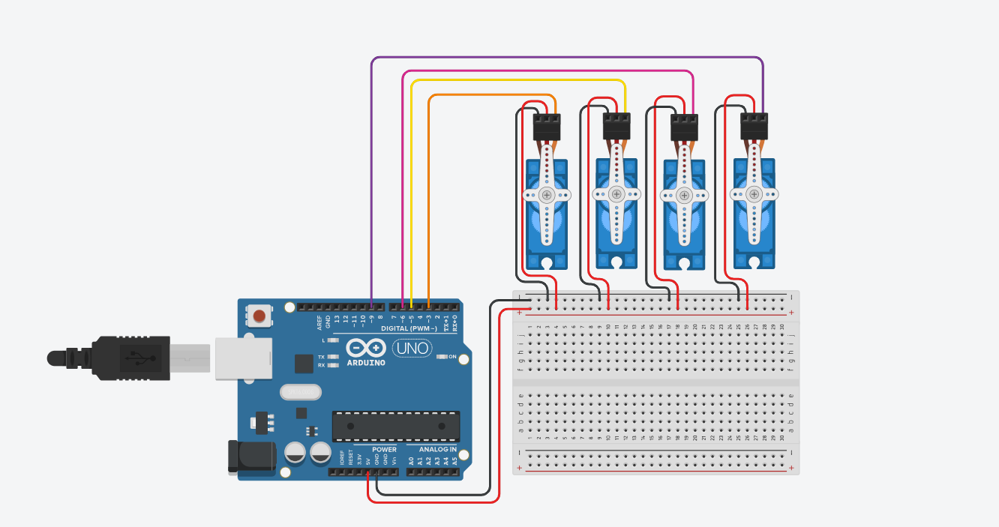

# Servo-Motor-Control

Control four servo motors simultaneously using an Arduino Uno. The motors operate for two seconds before stopping at a fixed angle of 90 degrees.

---

## Project Overview

This project demonstrates synchronized control of four servo motors using an Arduino Uno and the Servo library. All motors move together for two seconds before stopping at a fixed angle of 90 degrees.

---

## Components

- Arduino Uno
- Breadboard
- 4 × Servo Motors
- Jumper Wires

---

## Circuit Connections

| Component | Arduino Pin |
|-----------|-------------|
| Servo 1 (Signal) | D3 |
| Servo 2 (Signal) | D5 |
| Servo 3 (Signal) | D6 |
| Servo 4 (Signal) | D9 |
| All Servo VCC | 5V |
| All Servo GND | GND |

---

## Circuit Diagram

